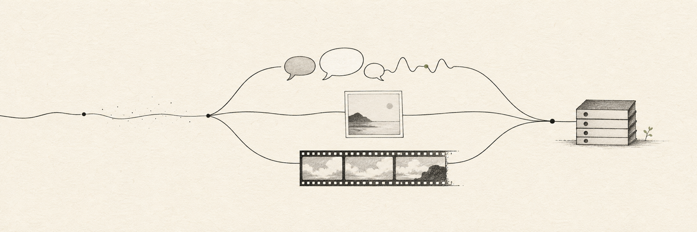
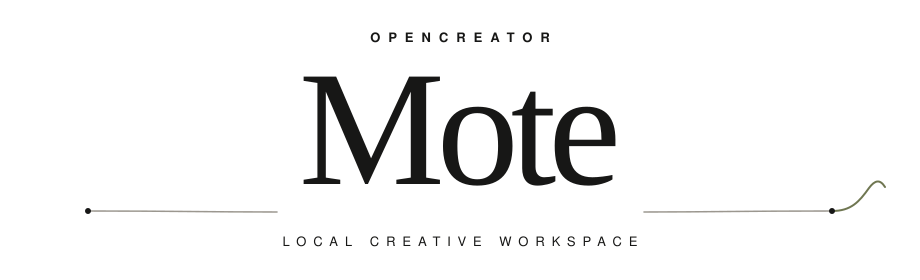
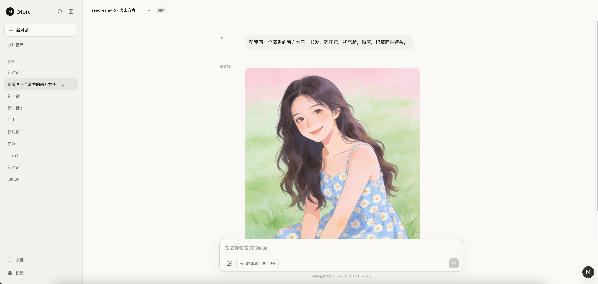
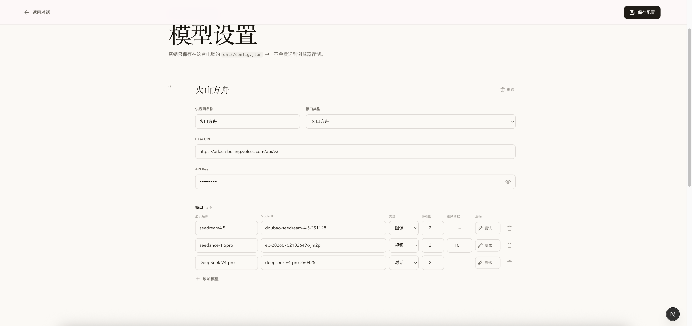

<div align="center">





### Create with any model. Keep everything local.

一个为连续对话、图片与视频生成而生的本地 AI 工作台。<br />
把原本散落在代码里的模型调用，收进一个安静、顺手的界面。

[](https://nextjs.org/)
[](https://www.typescriptlang.org/)
[](#本地优先)
[](#开发与检查)

</div>

---

## 一处输入，三种创作

| CHAT | IMAGE | VIDEO |
| :--- | :--- | :--- |
| 保留上下文的连续对话，在多个历史会话之间自由切换。 | 文生图、图生图、多参考图、尺寸比例与批量生成。 | 文生视频、首帧、首尾帧和多参考图模式，支持异步任务状态。 |

Mote 不是云端平台，也不准备替你管理账号。它只是一个运行在自己电脑上的轻量外壳：连接你已经拥有的模型接口，把配置、对话、上传内容和生成结果留在项目目录里。

<p align="center">
  
</p>

<p align="center"><sub>在同一处完成对话、加入参考图片，并生成和保存创作结果。</sub></p>

## 现在已经能做什么

- **多供应商与多模型**：同一供应商可以配置多个聊天、图片或视频模型。
- **连续对话**：保留上下文，支持多会话、重命名、搜索和删除确认。
- **灵活加入图片**：点击选择、复制粘贴或直接拖入输入框。
- **图片生成参数**：智能/自定义比例、2K/4K、1–4 张生成数量。
- **视频生成参数**：参考模式、比例、分辨率、3–60 秒模型上限、数量、声音与水印。
- **友好的等待过程**：生成状态轮播、任务轮询和运行中停止。
- **本地资产库**：统一查看图片与视频，支持回收站和永久删除。
- **真实连通性测试**：验证凭证与接口，不用一次付费生成冒充“测试成功”。
- **模型能力约束**：可为不同模型设置最大参考图数量和最长视频时长。

## 把模型带进来

供应商、接口类型与模型能力都集中在一个页面。你可以为每个模型分别声明用途、参考图上限和视频时长，再通过真实连通性测试确认配置。

<p align="center">
  
</p>

<p align="center"><sub>凭证仅保存在本机；截图中的 API Key 已遮罩。</sub></p>

## 支持的接口类型

| 接口类型 | 鉴权方式 | 对话 | 图片 | 视频 |
| :--- | :--- | :---: | :---: | :---: |
| 火山方舟 | Bearer API Key | ✓ | ✓ | ✓ |
| OpenAI Compatible | Bearer API Key | ✓ | 取决于上游 | 取决于上游 |
| 即梦视觉 | Volcengine AK / SK | — | ✓ | ✓ |
| 可灵 API 2.0 | Bearer API Key | — | ✓ | ✓ |

> 模型能力最终以上游官方文档为准。Mote 会尽量在请求发出前拦截不支持的参考图数量、时长和生成模式，避免无效调用。

## 快速开始

### 1. 启动

```bash
git clone git@github.com:hughedward/openCreator.git
cd openCreator
npm install
npm run dev
```

打开 [http://localhost:3000](http://localhost:3000)。

### 2. 配置供应商

进入右下角的 **设置**，添加供应商并选择对应的接口类型：

```text
供应商名称   方便自己识别即可
接口类型     火山方舟 / OpenAI Compatible / 即梦视觉 / 可灵 API 2.0
Base URL     上游服务地址
凭证         API Key，或即梦视觉所需的 AK / SK
Model ID     上游模型 ID；即梦视觉填写官方 req_key
模型类型     对话 / 图像 / 视频
```

保存前可以点击模型右侧的 **测试**，检查地址、凭证和模型配置。

<details>
<summary><strong>常用 Base URL 示例</strong></summary>

| 服务 | Base URL |
| :--- | :--- |
| 火山方舟 | `https://ark.cn-beijing.volces.com/api/v3` |
| DeepSeek | `https://api.deepseek.com` |
| 即梦视觉 | `https://visual.volcengineapi.com` |
| 可灵 API 2.0 | `https://api-singapore.klingai.com` |

</details>

## 本地优先

Mote 没有用户系统、远程数据库或遥测服务。你的工作内容保存在本机：

```text
data/
├── config.json             # 供应商、模型与密钥配置
└── conversations/          # 历史会话

out/
├── uploads/                # 上传的参考图片
├── images/                 # 生成的图片
└── videos/                 # 生成的视频
```

- 密钥不会写入浏览器 `localStorage`。
- 设置页面显示的是遮罩值，只有主动点击眼睛按钮才从本机读取。
- `data/`、`out/`、`.env*` 已加入 `.gitignore`，不会被提交到仓库。
- 上游返回临时媒体地址后，Mote 会尽快下载到 `out/`。

## 项目结构

```text
src/
├── app/
│   ├── api/                # 配置、会话、生成、任务与资产接口
│   ├── assets/             # 本地资产页面
│   └── settings/           # 模型设置页面
├── components/             # 聊天、参数面板、侧栏与资产组件
└── lib/
    ├── providers/          # 方舟、OpenAI、即梦与可灵适配器
    ├── *-store.ts          # JSON 与媒体存储
    └── schemas.ts          # 配置和请求校验
```

技术栈保持得很轻：**Next.js 16 · React 19 · TypeScript · Zod · Vitest**。

## 开发与检查

```bash
npm test
npm run typecheck
npm run lint
npm run build
```

## 当前边界

- 这是单用户、本机使用的工具，不包含登录、权限和多设备同步。
- 不同厂商的图片、视频参数并不完全一致；适配器只发送官方支持的字段。
- 即梦视觉和可灵目前不提供通用的远端任务取消能力。点击停止会结束本机等待，但云端任务可能继续执行。
- 连通性测试不会发起付费生成；最终模型效果仍需要使用自己的凭证实际验证。

---

<div align="center">

**Mote** — quiet tools for noisy ideas.

</div>
